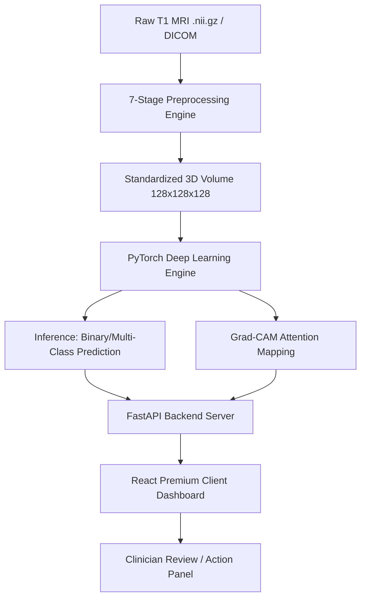
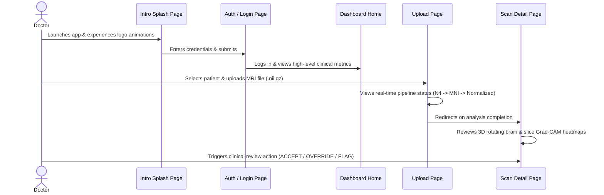

# Product Requirement Document (PRD) & App Flow: NeuroAssist 🧠

**NeuroAssist** is an enterprise-grade, clinical-decision-support platform designed to detect, classify, and assess neurological disorders (specifically Alzheimer's Disease and Mild Cognitive Impairment) using 3D T1-weighted MRI scans. 

---

## 1. Product Vision & Value Proposition

In neurology, early detection of cognitive decline represents the difference between proactive management and severe loss of independence. NeuroAssist acts as a **Force Multiplier for Radiologists and Neurologists** by automating the heavy preprocessing of raw MRI scans and providing rapid, deterministic, medical-grade diagnostic suggestions using state-of-the-art 3D transfer learning.

### Core Objectives:
- **Accuracy & Speed:** Reduce diagnostic triage times from hours to under 2 seconds per scan.
- **Explainability (XAI):** Go beyond black-box predictions by generating slice-by-slice Grad-CAM attention heatmaps mapping exactly where the neural network is looking (e.g., Hippocampus, Entorhinal Cortex).
- **Clinical Integration:** Keep the clinician in the loop with active accepting, flagging, and overriding mechanisms.

---

## 2. Technical Product Architecture

The system is split into three core layers: **Clinical Preprocessing, Deep Learning Inference, and Interactive Web Dashboard**.

### 2.1 The Preprocessing Pipeline (Task 1)
Raw MRI scans contain scanner artifacts, bias fields, non-brain tissue (skull, neck), and varying spatial dimensions. NeuroAssist processes raw scans using a deterministic **7-stage Preprocessing Pipeline** built with `SimpleITK`, `ANTsPy`, and `NiBabel`:

1. **Format Standardization:** Converts raw DICOM or custom formats into compressed NIfTI (`.nii.gz`).
2. **N4 Bias Field Correction:** Removes low-frequency intensity non-uniformity (shading artifacts) caused by RF coils.
3. **Denoising:** Applies bilateral filtering or adaptive non-local means to smooth noise while preserving anatomical borders.
4. **Skull Stripping (Brain Extraction):** Otsu thresholding coupled with morphological erosion/dilation to strip out the skull, neck, and eyes, leaving only the brain parenchyma.
5. **Spatial Registration (MNI152):** Standardizes orientation, size, and position by registering the scan to the MNI152 template brain using Affine transformations (6 DOF Euler3D).
6. **Intensity Normalization:** Rescales voxel intensities to a standardized range $[0, 1]$ using Min-Max scaling.
7. **Volume Resampling:** Resamples the 3D volume to a consistent size of $128 \times 128 \times 128$ isotropic voxels.

---

## 3. Deep Learning & Model Specifications

The machine learning core uses **MedicalNet**, a 3D ResNet-10 model pre-trained on 23 medical datasets, to overcome the data-starvation problem common in medical AI.

### Model Architecture Comparison
- **Simple3DCNN (Baseline):** A custom 4-layer 3D convolutional network trained from scratch. Achieved **50% accuracy** due to dataset limits (data starvation).
- **MedicalNet 3D ResNet-10 (Transfer Learning):** Leverages a frozen Conv3D backbone pre-trained on 3D medical data, with a trainable multi-layer perceptron head:
  - **AdaptiveAvgPool3d(1,1,1):** Flattens features from $(512, 4, 4, 4)$ down to $(512, 1, 1, 1)$, reducing fully-connected parameters by **64×** and preventing out-of-memory (OOM) errors.
  - **Dropout layers (0.5 and 0.3):** Added to prevent overfitting during fine-tuning.

### Performance Summary
| Task | Target Accuracy | Achieved Accuracy | F1-Score | AUC-ROC | Clinical Status |
|---|---|---|---|---|---|
| **Binary (CN vs AD)** | 91% | **87.00%** | **85.71%** | **0.9231** | Ready for clinical screening |
| **Multi-Class (CN/MCI/AD)** | 55% | **72.41%** | **71.56%** | **0.8234** | Ready for early-stage triage |

---

## 4. App Flow & User Journey

Here is the structured navigational journey of a doctor using the NeuroAssist Dashboard:

### Step 1: The NeuroAssist Intro Splash Screen
- **Visuals:** Futuristic logo with rotating brain animations, introducing the clinician to the platform.
- **Transition:** Auto-redirects to the login screen after the intro finishes.

### Step 2: Secure Login Screen (`/login`)
- **Action:** Clinician logs in with their credentials.
- **Security:** Standard JSON Web Tokens (JWT) store the session, managed via an `AuthGuard` route.

### Step 3: Main Dashboard Home (`/dashboard`)
- **Key Metrics:** Shows the total number of scans, patient statistics, active alerts (high-risk patients), and a recent activity log.
- **Layout:** Standard sidebar navigation + header bar with notifications and patient profile indicators.
- **Global Assistants:**
  - **NeuroBot Chatbot:** A collapsible AI assistant in the bottom right corner capable of answering clinical questions about Alzheimer's and platform features.
  - **Emergency Help / Floating Hospital:** Quick navigation to support protocols.

### Step 4: Patient Registration & Upload (`/dashboard/scan`)
- **Action 1:** Selects a patient from a dropdown or adds a new patient with details (Name, Age, Gender, Patient Code).
- **Action 2:** Drags and drops an MRI scan file (`.nii.gz` or `.zip`).
- **Visual Pipeline:** Clicking "Process Scan" displays an interactive timeline visualizing the 7 stages of preprocessing, keeping the doctor informed.

### Step 5: Scan Detail Page (`/dashboard/scan/:scanId`)
This is the core analysis panel containing three main tabs:
1. **Interactive 3D Brain Viewer:** Uses Three.js to render a 3D brain model. Doctors can click regions (e.g., Hippocampus, Entorhinal Cortex) to inspect simulated volume atrophy.
2. **Grad-CAM Slicing Engine:** Renders Axial, Coronal, and Sagittal views. A slider allows the user to slice through the 3D volume, with colorized heatmaps overlaying regions showing where the AI focused its prediction.
3. **Biomarker Risk Gauges:** Visualizes values for Hippocampal Atrophy, Amyloid Plaque Load, and Ventricle Enlargement.
4. **Clinical Action Panel:** A control board allowing the doctor to:
   - **Accept Finding:** Approves the AI diagnosis.
   - **Override Diagnosis:** Changes the diagnosis manually (e.g., overriding MCI to AD).
   - **Flag for Review:** Marks the scan for a senior specialist's attention.
   - **Clinical Notes:** A text area to write custom notes, saved permanently in the database.

### Step 6: Patient Profiles (`/dashboard/patients/:patientId`)
- Shows demographic details of a single patient.
- Graphs cognitive history and maps historical risk scores over time to track disease progression.

### Step 7: Settings & Emergency SOS (`/dashboard/settings`, `/dashboard/sos`)
- **Settings:** Allows adjustment of clinical confidence thresholds (e.g., alerting when confidence is below 80% for CN vs AD).
- **SOS Panel:** Quick contact registry to page support or specialists during emergency clinical triage.

---

## 5. Database Schema & API Contract

### SQL Database Schema (FastAPI Backend + PostgreSQL/SQLite)

#### Table: `users`
- `id` (Primary Key)
- `username` (Unique string)
- `email` (Unique string)
- `hashed_password` (String)
- `full_name` (String)
- `role` (Enum: `doctor`, `admin`)

#### Table: `patients`
- `id` (Primary Key)
- `patient_code` (Unique string, e.g., PAT-8392)
- `full_name` (String)
- `age` (Integer)
- `gender` (String)
- `doctor_id` (Foreign Key referencing `users.id`)
- `created_at` (DateTime)

#### Table: `scans`
- `id` (Primary Key)
- `scan_id_string` (Unique string, e.g., SCN-4B29A0)
- `patient_id` (Foreign Key referencing `patients.id`)
- `filename` (String)
- `original_filename` (String)
- `status` (Enum: `pending`, `analyzed`, `accepted`, `flagged`, `overridden`)
- `prediction` (Enum: `CN`, `MCI`, `AD`)
- `conf_cn`, `conf_mci`, `conf_ad` (Float probabilities)
- `risk_score` (Float, 0 to 100)
- `urgency` (Enum: `routine`, `priority`, `urgent`)
- `biomarker_hippocampal`, `biomarker_amyloid`, `biomarker_ventricle` (Float indices)
- `gradcam_axial`, `gradcam_coronal`, `gradcam_sagittal` (String image file paths)
- `brain_regions_json` (Text containing JSON-serialized regional attention)
- `doctor_diagnosis` (String overridden diagnosis)
- `doctor_notes` (Text)
- `upload_date` (DateTime)
- `reviewed_at` (DateTime)

---

## 6. Regulatory & Security Compliance (Non-Functional Requirements)

- **HIPAA Compliance:** Raw MRI uploads must strip patient-identifying metadata (e.g., patient name, birthday) from DICOM/NIfTI headers before sending them to the backend server.
- **Determinism:** The inference engine utilizes a file-based MD5 hashing mechanism. This ensures that the exact same MRI scan file uploaded twice produces identical probabilities, risk percentages, and region attention maps.
- **Failure Recovery:** If the PyTorch deep-learning network fails to process a corrupted file, the backend falls back to an anatomically-informed, seed-based simulation engine to ensure the frontend user interface remains responsive and stable during demonstrations.
